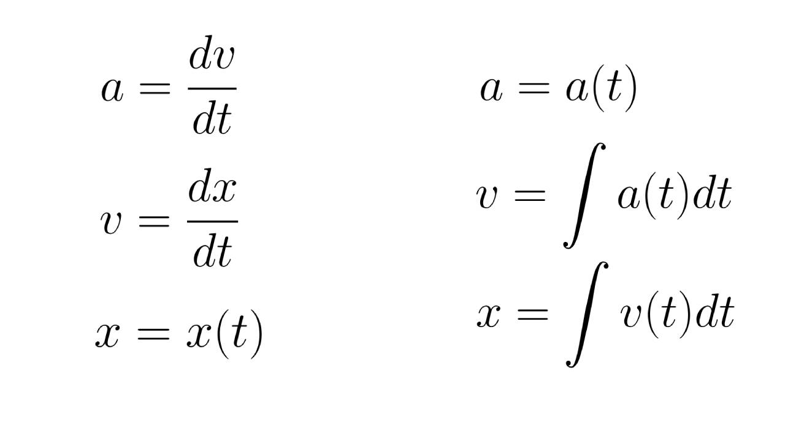
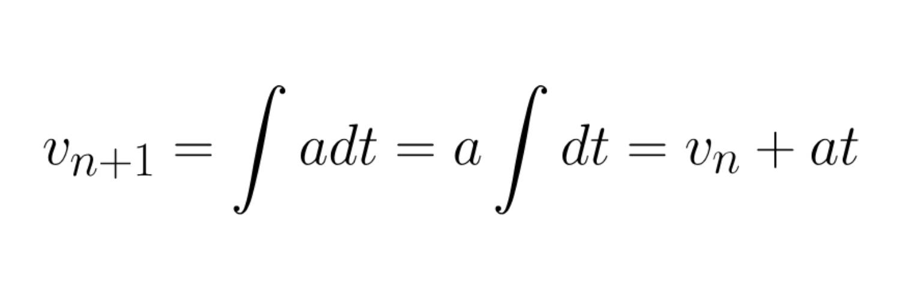
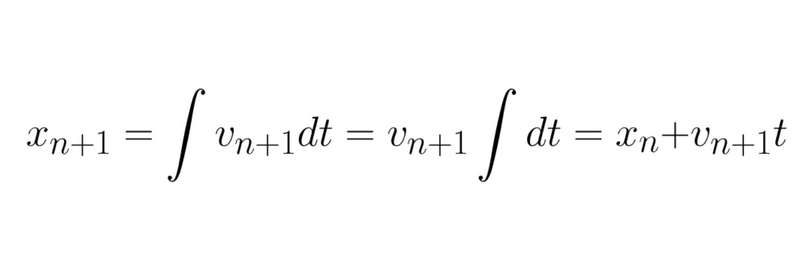
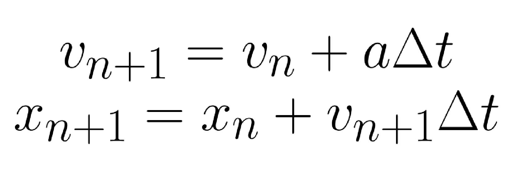

# Position, linear velocity and acceleration

The first and simplest thing to do when we need to simulate physics is applying forces to object.<br>
To create such a simulation, we need to know what is position, linear velocity and acceleration, four fundamental concepts in physics:

<ul>
    <li><b>Position:</b> When we are talking about position, we are referring to where something is in a specific space which, in our simulation, would be the screen.</li>
    <li><b>Linear velocity:</b> Velocity is nothing but how much the position changes over time.</li>
    <li><b>Acceleration:</b> Following the same logic, acceleration is just the rate of change of a body's linear velocity over time.</li>
</ul>

If you are familiar with either physics or mathematics, you could probably recognize them as derivatives, being the linear velocity the derivative of the position and the acceleration the derivative of the linear velocity. In the same way, linear velocity would be the integral of the acceleration and position the integral of the linear velocity.

<div align="center">
    
</div>

Nevertheless, when it comes to programming, we don't usually have an actual function to calculate the position, linear velocity and acceleration. We don't have either a way to quickly compute a derivative or integral, although if we had it, we could not use it because what we have in programming is always discrete, no continuous.
Since we cannot use this, we can approximate the values.

There are several ways to approximate the values such as the <em>Midpoint method</em>, the <em>Ranga-Katta method</em> but, albeit accurate, they are super slow to compute, which means that we have to look for something faster.
Let's say acceleration will be always mathematically constant even though we can change it at any point, it means that we can have always a formula for both linear velocity and position.

<div align="center">
    
</div>

And with it, since the new linear velocity is already calculated, and it must be a constant now, we can treat it as a constant and follow the same logic for the position.

<div align="center">
    
</div>

We have got two formulas with a parameter t, time. This parameter just refers to the time passed from the last calculation to the new one. Since we are going to compute all of this at least once per frame, it is the famous delta-time.

<div align="center">
    
</div>

We ended up with these simple formulas which we are going to use. All of this, in code, would look something similar to this code below:

```
Update(deltaTime)
    linear_velocity += acceleration * deltaTime;
    position += linear_velocity * deltaTime;
``` 

This is called `Semi-implicit Euler method`, which is not the most accurate whatsoever, but it is fast and accurate enough to make our simulation.

## Gravity

Once we have everything ready to start testing, we should also add gravity to our simulation.
When we are studying physics, gravity at the beginning is only a constant acceleration <em>g</em>. Hence, we are going to treat it in the same way as a constant vector pointing down:

```
acceleration = Vector(0, -9.8);

Update(deltaTime)
    linear_velocity += acceleration * deltaTime;
    position += linear_velocity * deltaTime;
``` 