# Collision detection

There are several ways to detect collisions, but in this case, we are going to discuss the SAT algorithm.<br>
At first instance, we have got a problem: it is not the same how we can get the collisions between two polygons, two circles or a circle with a polygon. Hence, we need to use a different algorithm for each one.<br>
The goal with it for the moment is to find the next information:

<ul>
    <li>Check if the two bodies are overlapping.</li>
    <li>Get a normalized normal vector to the collision to be able to response to it.</li>
    <li>Obtain how much are the bodies overlapping.</li>
</ul>

## Circle vs Circle

This is the simplest case. Let's say we have a circle A with radius r<sub>A</sub> and another circle B with radius r<sub>B</sub>. Each one, as we have made before, counts with a position P<sub>A</sub> and P<sub>B</sub>.<br>
The first thing we have to do is calculate the distance between the positions P<sub>A</sub> and P<sub>B</sub>.

<div align="center">
    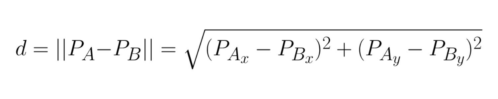
</div>

And now, it turns out that if the distance between these two positions is lower os equal than the summation of the radius, there is a collision.

<div align="center">
    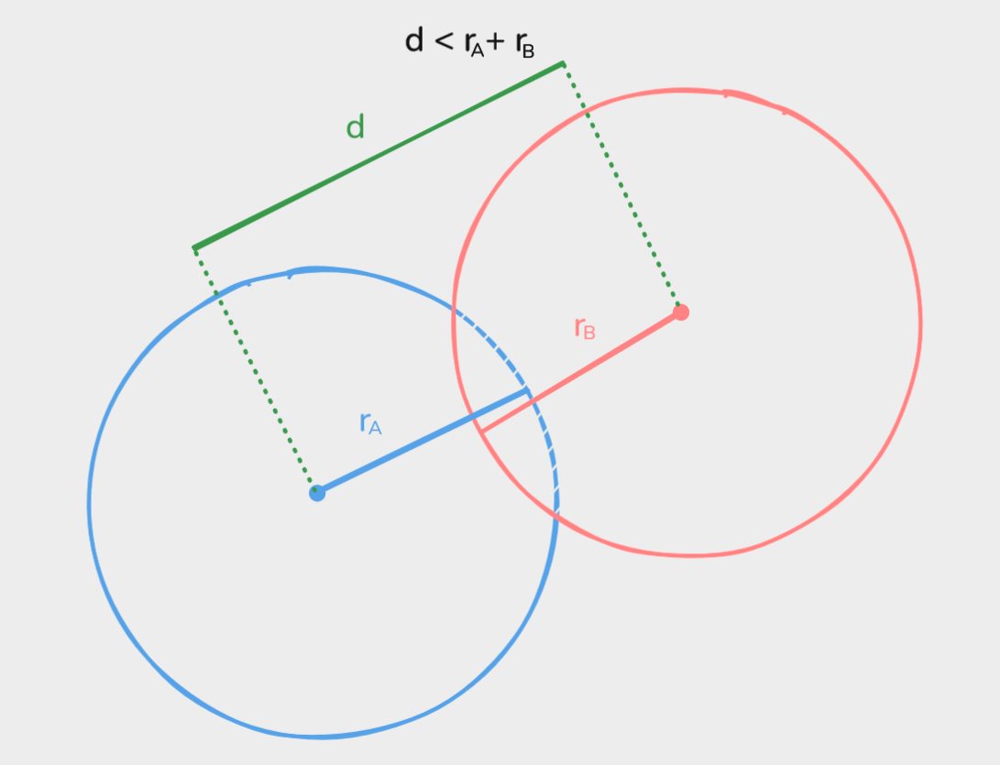
</div>

Now, we need to get more information such as the normal vector and the collision depth.<br>
The normal is quite simple, we just need to subtract both positions and normalize the result. For the depth we just need to subtract the summation of the radios with the distance.

<div align="center">
    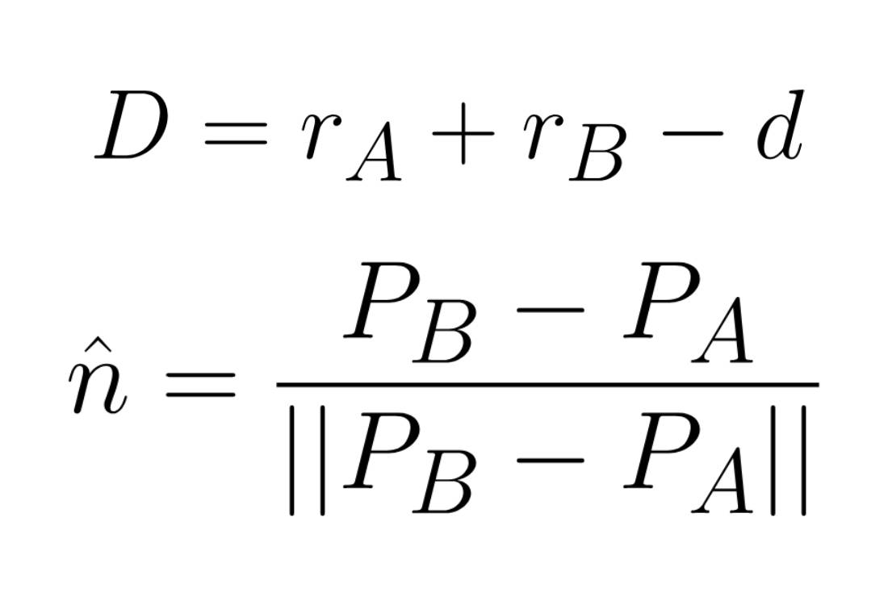
</div>

```
normal = Vector.Zero;
depth = 0;

circle_vs_circle(PA, PB, rA, rB)
    difference = PB - PA;
    distance = Vector.Magnitude(difference);
    sum_radius = rA + rB;
    
    if distance <= sum_radius
        normal =  difference / distance;
        depth = sum_radius - difference;
        return true;
    
    return false;
```


## Polygon vs Polygon

Now, this will get a little harder, but once you finish it, you realize how simple is that, actually.<br>
First, we must be careful because this whole algorithm relies on the order we are going to get the vertices of the polygon, because we will have to calculate the normal of each edge using them.<br>
This algorithm SAT (Separating Axis Theorem) says that, if we use the normals of each face of both polygons as axes, and we project both polygons onto the axes, if there is at least one axis where the projections of both are not overlapping, then there is not a collision.<br>
Said like that is sort of scary, but let's go little by little.<br>
Once we have the vertices ordered, we can go for each one and subtract the next vertex with the current one to get a vector pointing from the vertex to the next one.

<div align="center">
    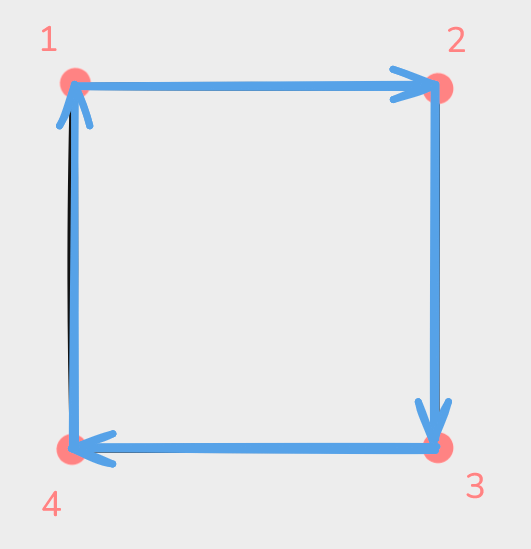
</div>

After that, we rotate that vector 90º to get the direction of the normal of the current edge, and we normalize it.

<div align="center">
    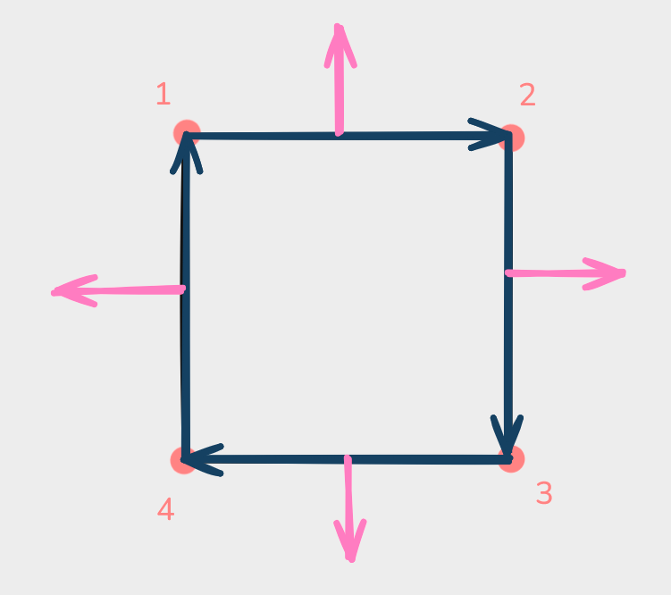
    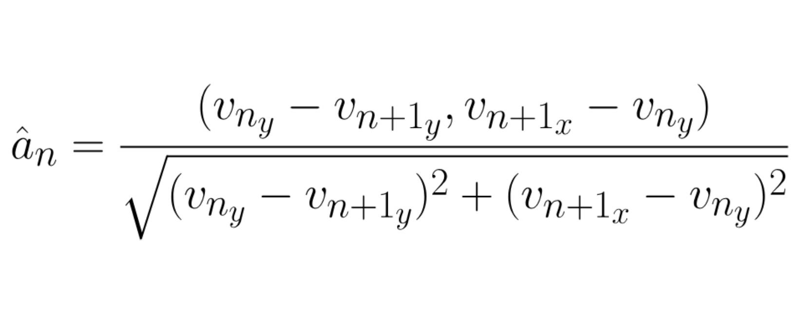
</div>

This first part of the algorithm would look something like this:

```
get_polygon_axes(vertices)
    for i <- 0 to #vertices step 1
        vertex = vertices[i];
        next = vertices[(i + 1) % #vertices];
        edge = next - vertex;
        normal = Vector(-edge.y, edge.x) / sqrt(pow(edge.y, 2) + pow(edge.x + 1));
```

Next, we must project the polygons onto the obtained axes, so for each axis, I project all the vertices and only use the maximum and minimum values.<br>

<div align="center">
    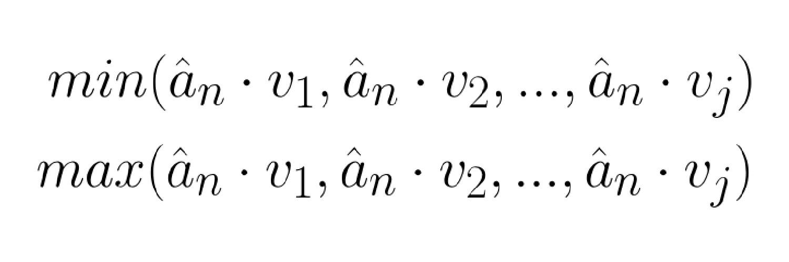
</div>

```
min = inf;
max = -inf;

get_projection(axis, vertices)
    for i <- 0 to #vertices step 1
        vertex = vertices[i];
        projection = Vector.Dot(vertex, axis);
        
        min = Min(min, projection);
        max = Max(max, projection);
```

And now, once we have the projection of both polygons on the axes, we have to check if that projection is overlapping. In order to check it, we must bear in mind the fact that we have for each one a minimum and a maximum value as we can see in the picture below.

<div align="center">
    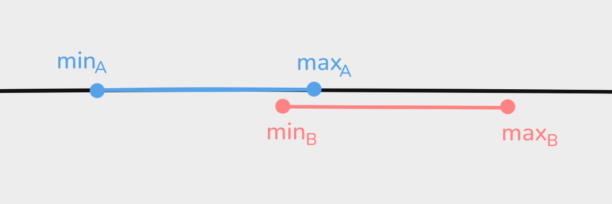
</div>

We know that min<sub>B</sub> has to be lower than max<sub>A</sub>, because if it is not, the red shape would be more on the right without overlapping. However, this condition also applies if the red shape is on the left-hand side, so we must also say that max<sub>B</sub> is greater than min<sub>A</sub>

<div align="center">
    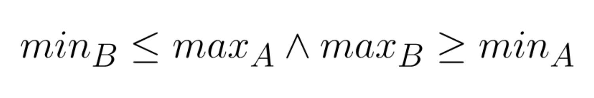
</div>

If our projections in at least one axis doesn't obey this conditions, then there is no collision, which mean that we can stop our algorithm in order to optimize it. But if all the projections obeys it, we would need to calculate both the normal and the depth.<br>
We must calculate first the depth to later calculate the normal, after all this just will be a piece of cake. We just have to calculate how much each projection is overlapping and save the smallest one.<br>
To end it up, we just set the normal as the axis with the smallest depth, but it can be inverted according to which one is on the right-hand side or in the left-hand side. Hence, we can compute the dot product of the normal and a vector pointing from the first polygon to the second one and, if it is negative, invert the normal.

```
min_depth = inf;

get_polygon_axes(verticesA);
get_polygon_axes(verticesB);

for i <- 0 to #axes step 1
    axis = axes[i]
    
    get_projection(axis, verticesA);
    get_projection(axis, verticesB);
    
    if minB <= maxA and maxB >= minA
        reutrn false;
    
    depth = Min(maxA - minB, maxB - minA)
    
    if min_depth > depth
        min_depth = depth;
        normal = axis;

if Vector.Dot(normal, positionB - positionA) < 0
    normal *= -1;

return true;
```

## Circle vs Polygon

When it comes to collisions between a polygon and a circle, the algorithm is sort of odd, but once you understood collisions `Circle vs Pircle` and `Polygon vs Polygon` it is kind of intuitive. We are going to use the same algorithm we used for collisions `Polygon vs Polygon` but picking strategically the axis and vertices of my circle for the projections.<br>
The axis the circle will provide will be just the direction from the circle to the closest vertex of the polygon.

<div align="center">
    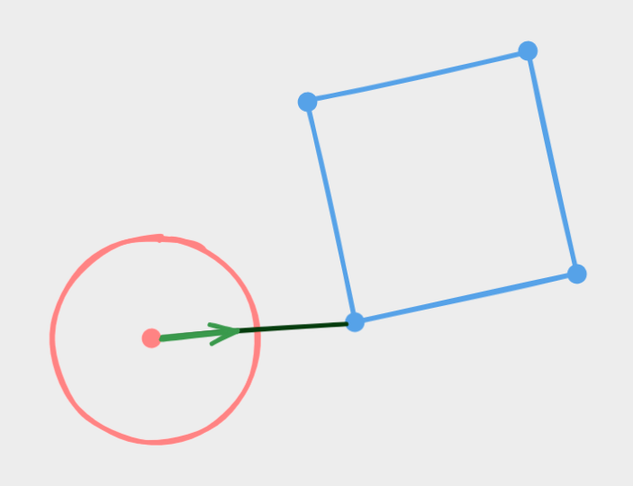
</div>

For the <em>"vertices"</em> to project from the circle, we must make something a bit harder than for the axis, but it is also very simple.<br>
It would not even be fair call it <em>"vertices"</em> because a circle cannot have vertices, so let's start calling them extreme points because these points are exactly that, extreme points. When we are projecting the vertices onto the axis, we get the direction of the axis, and we get these extreme points in the circle like this:

<div align="center">
    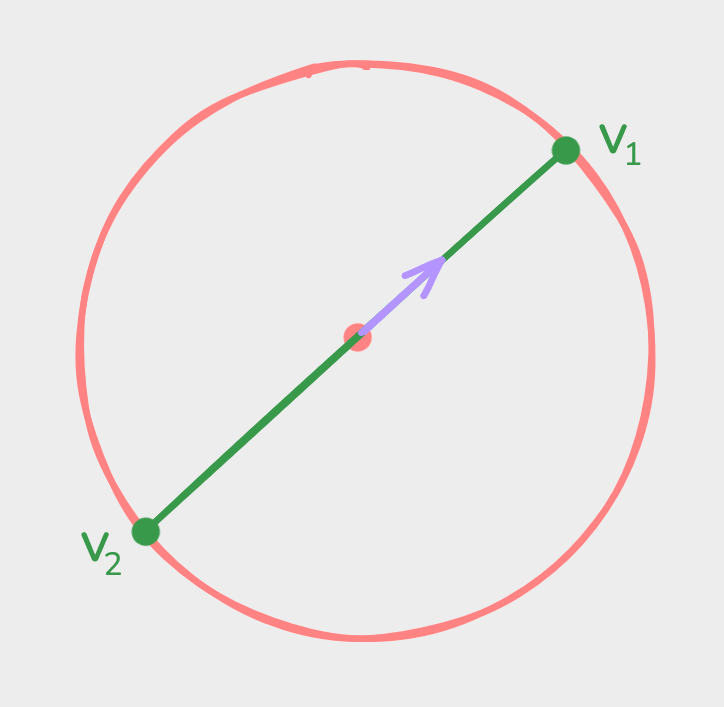
    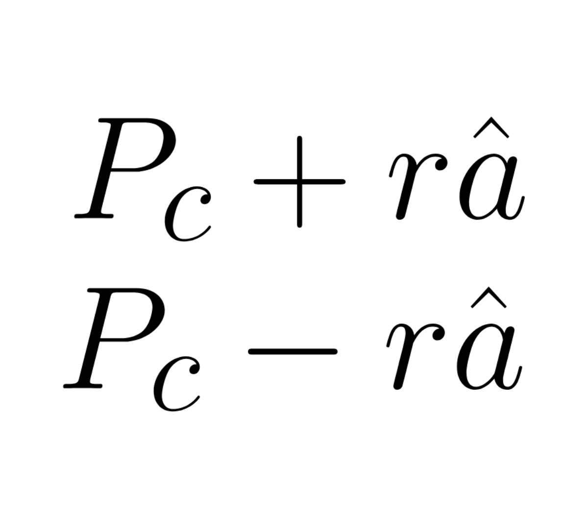
</div>

This is the only actual change, the rest part of the algorithm is exactly the same as before.

## Optimizing

As you might be able to tell, computationally it can be expensive. Fortunately, we have a way to avoid that many operations in case the shapes are too far away to be colliding.<br>
The trick here is another algorithm called <em>AABB</em> which is super simple to understand and super fast to compute. In fact, we have made a kind of <em>AABB</em> already when we calculated <em>polygon vs polygon</em> collisions with the next condition:

<div align="center">
    
</div>

That's exactly the logic for the <em>AABB</em> in a single dimension, so we can extend it to any dimensions we need. In this case, it would be for two dimensions.<br>
We can seize it to optimize our collisions by checking with <em>AABB</em> if they are near a collision and then, execute all the process we have been discussing before.