# Contact points

When we are creating a collision solver, unless we just want to change the position to prevent them from rotating, we would also need to get the positions where the two bodies had the collision.<br>
Before starting calculating the contact points, we need another algorithm to calculate the closest positing in a segment to a point in space, so let's start from that.

## Closest distance Segment-Point

This algorithm conceals such a geometrical beauty behind a lot of formulas and a few lines of code, so let's break it down.
First, we need 3 points in the space: the first one will be the point <em>P</em> and the other two will be the extremes of the segment <em>S<sub>1</sub></em> and <em>S<sub>2</sub></em>.

<div align="center">
    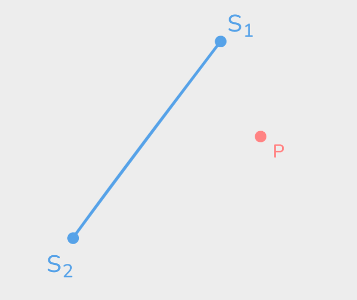
</div>

First, let's subtract <em>S<sub>2</sub></em> and <em>P</em> by <em>S<sub>1</sub></em> to obtain two vector from <em>S<sub>1</sub></em>, one towards <em>S<sub>2</sub></em> and the other one towards <em>P</em>.

<div align="center">
    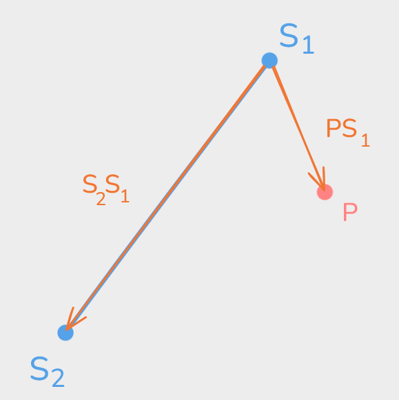
    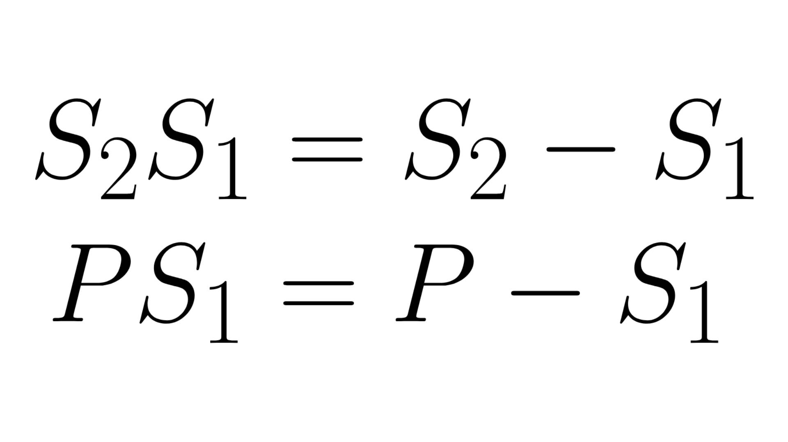
</div>

Now, we can project my Vector <em>PS<sub>1</sub></em> to obtain where the closest point is placed numerically. To do it, we would need to use the <em>dot product</em>.

<div align="center">
    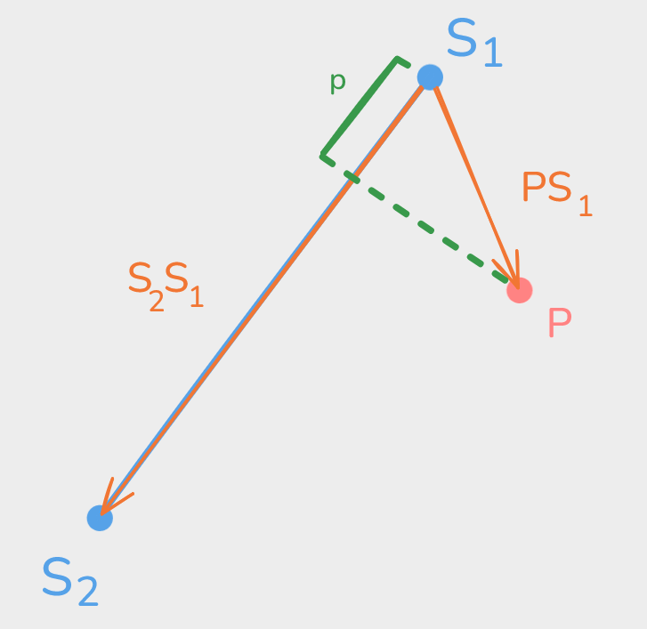
    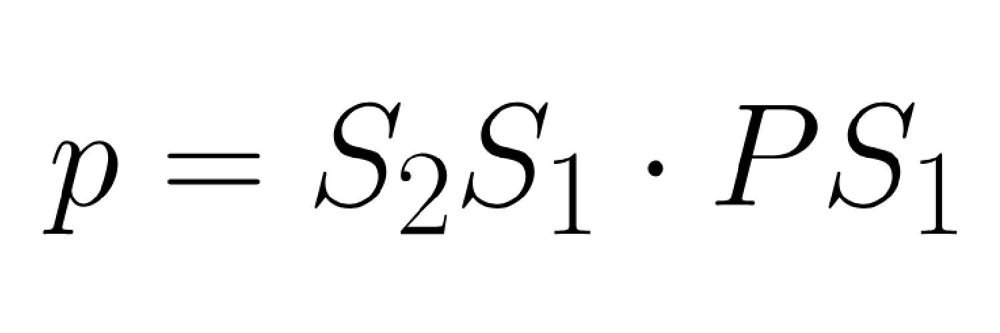
</div>

That projection must be normalized to keep working in order to be able to get the point per se and not only a representative value. Therefore, we must divide the projection by the maximum value of it, which is the squared of the magnitude of the line.<br>
Since we have got a projection value between 0 and 1, we can move along the line <em>S<sub>2</sub>S<sub>1</sub></em> from <em>S<sub>1</sub></em>.

<div align="center">
    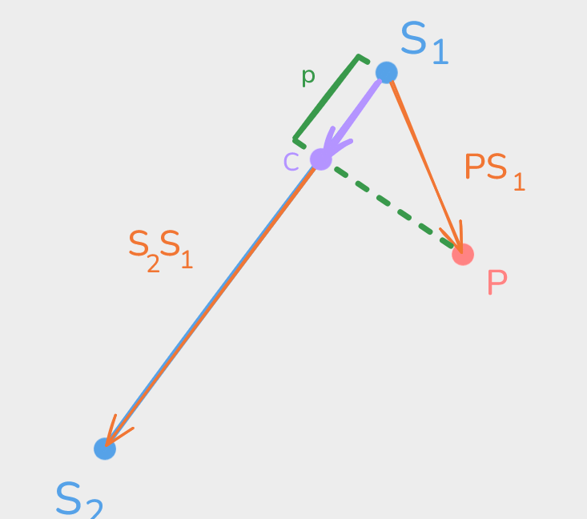
    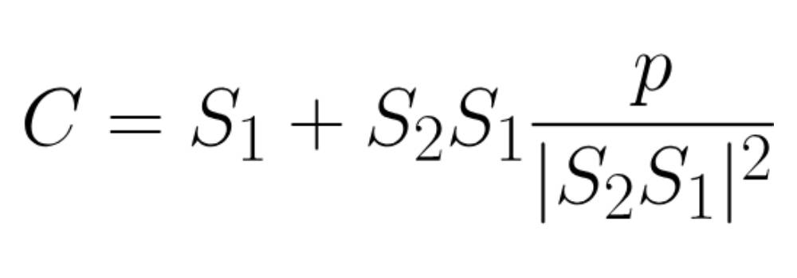
</div>

In a single formula, it would look something like this:

<div align="center">
    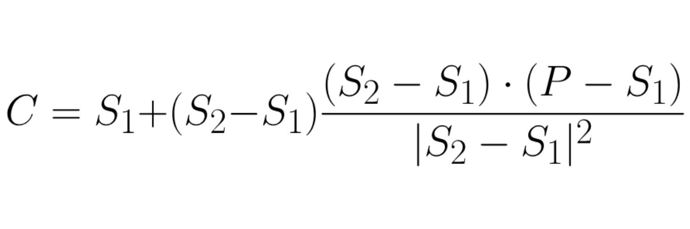
</div>

It does no longer look this scary, right?<br>
Additionally, we can clamp te projection to be only between 0 and 1.

## Circle vs Circle

Just like in the <em>collision detection</em> lesson, getting the contacts points in a <em>circle vs circle</em> collision is the simplest one.<br>
In this case, we will only have  a single contact point, but to calculate it, we will need first the circles colliding, with radius <em>r<sub>A</sub></em> and <em>r<sub>B</sub></em>, and position <em>P<sub>A</sub></em> and <em>P<sub>B</sub></em>.

<div align="center">
    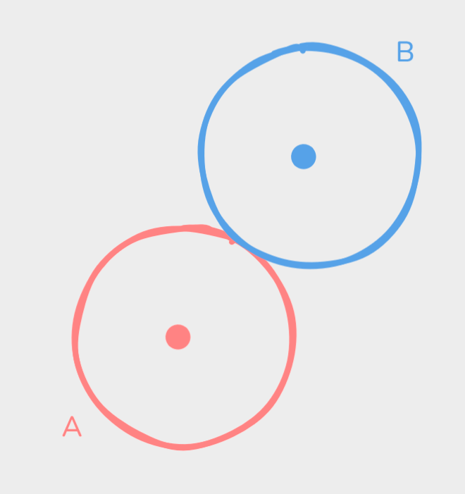
</div>

It is surprisingly intuitive, we would need to get a vector from the position of the circle <em>A</em> to the position of the circle </em>B</em>. If you sleep on it, it will give you the direction from the circle <em>A</em> to the contact point once this vector is normalized.

<div align="center">
    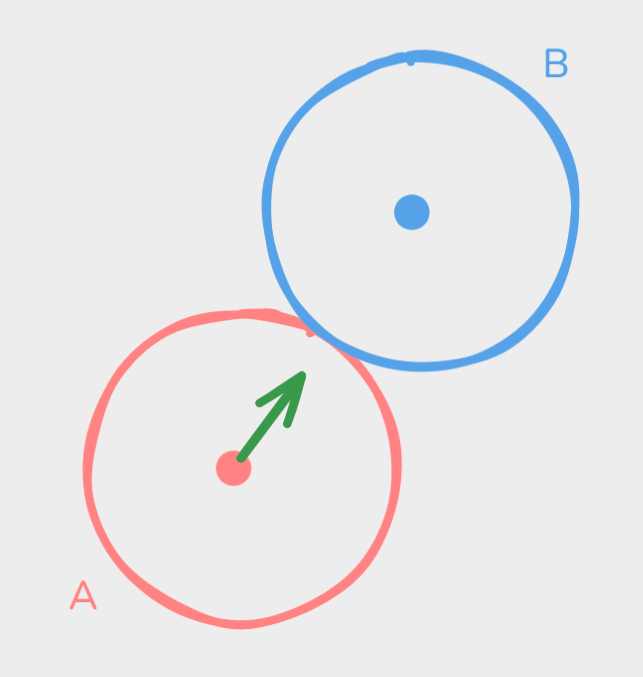
</div>

And, to end it up, we just need to multiply this vector by the radius of the circle <em>A</em>.

<div align="center">
    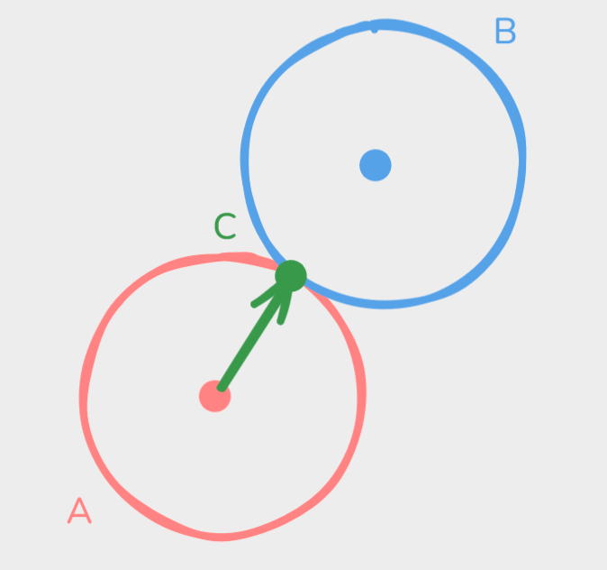
    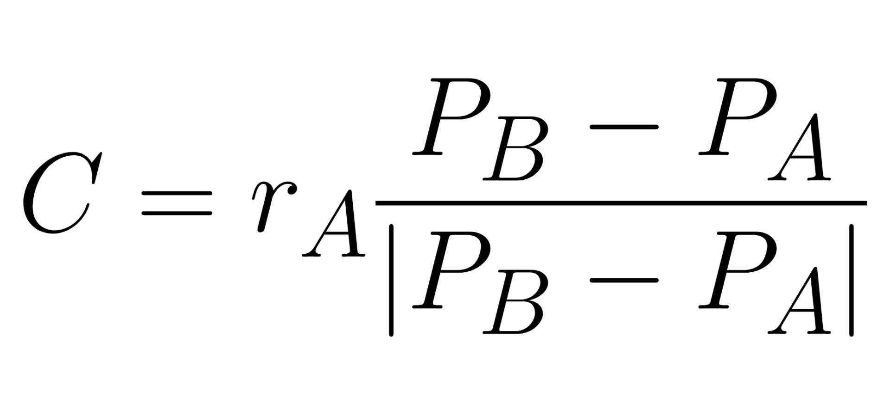
</div>

## Polygon vs Polygon

Besides the collisions <em>circle vs circle</em>, the collisions <em>polygon vs polygon</em> could have two contact points and probably is a little less intuitive, but at least we have made all the maths already.<br>
We need to go through all vertices from one polygon and, for each vertex, we need to go through all the edges from the other polygon in the same way we have done for the collision detection. And now, we must get the closest point in each edge to each vertex.

<div align="center">
    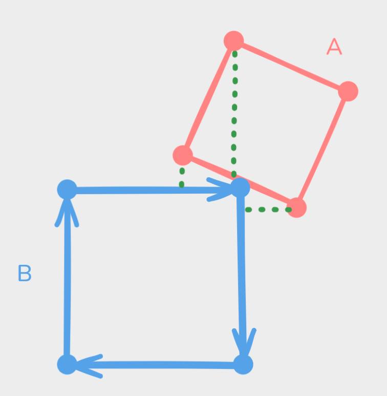
</div>

Once we have all the distances, we are going to save the closest one and, if we have another distance which is close enough to the closest one, we are going to save it too. The contact point will correspond with the actual point in the edges.

<div align="center">
    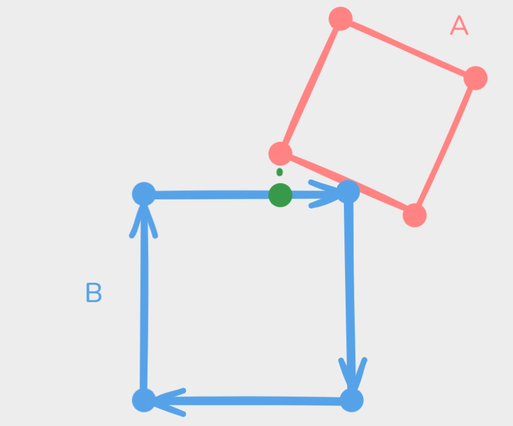
</div>

We will finish this whole algorithm by repeating this whole process in the other way: the axes in the second polygon <em>B</em> and the edges of the first polygon <em>A</em>.

<div align="center">
    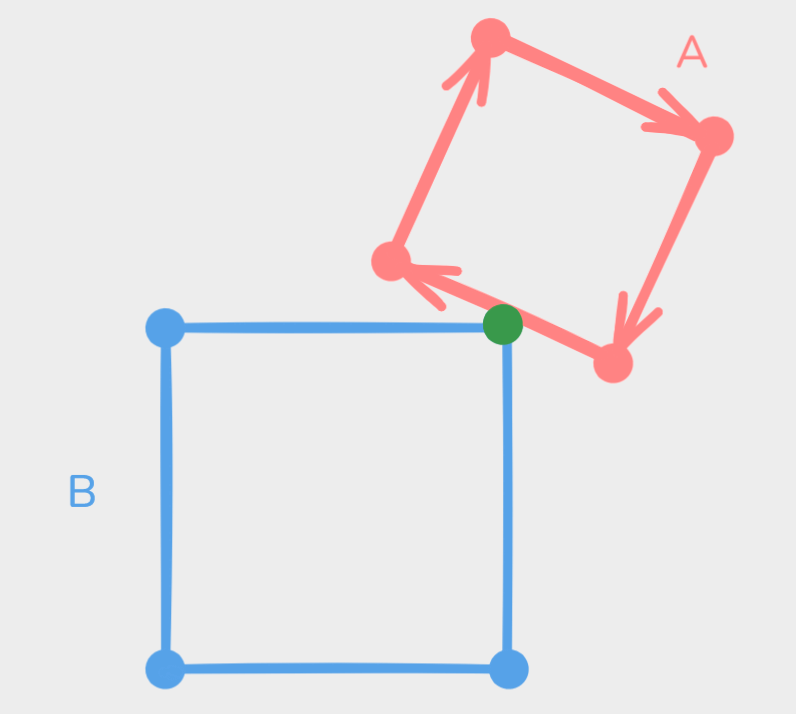
</div>

```
minimum_distance = inf;
contact_points_amount = 1;
contact_point1;
contact_point2;

vertices_onto_edges(vertices, edges)
    for i <- 0 to #vertices step 1
        vertex = vertices[i];
        
        for j <- 0 to #edges step 1
            edge = edges[j];
            
            distance, point = closest_distance_segment_point(vertex, edge);
            
            if is_close(distance, minimum_distance)
                
                if are_points_close(point, contact_point1)
                    contact_points_amount = 2;
                    contact_point2 = point;
            
            else if minimum_distance > distance
                minimum_distance = distance;
                contact_points_amount = 1;
                contact_point1 = point;
                

vertices_onto_edges(verticesA, edgesB);
vertices_onto_edges(verticesB, edgesA);
```

## Circle vs Polygon

Just like what we have done to detect collisions <em> circle vs polygon</em>, we are going to do something similar to what we have done to obtain the contact points for collisions <em>polygon vs polygon</em>.<br>
We are going to have a polygon <em>A</em> and a circle <em>B</em> in the position <em>P</em> and will have a radius of <em>r</em>.

<div align="center">
    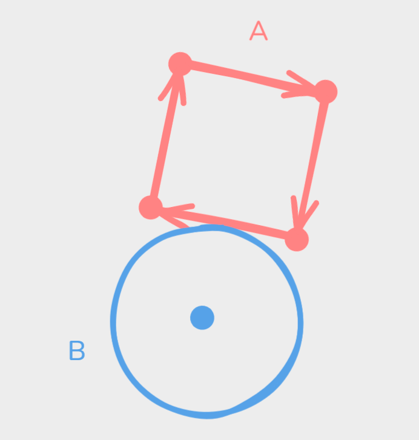
</div>

Then, we are going to do the same as before but with the <em>P</em>: we need to obtain the closest point to this point <em>P</em> along the edges. And to end it up, we only have to save the closest distance and the closest point.

```
minimum_distance = inf;
contact_point;

for i <- 0 to #edges step 1
    edge = edges[i];
    distance, point = closest_distance_segment_point(vertex, edge);
    
    if minimum_distance > distance
        minimum_distance = distance;
        ontact_point = point;
```