# Solving collisions

Once we know we have a collision and relevant information about it, the next step is creating a solver to react to it.<br>
Since now, it does not matter the shape, vertices or size, making it a lot easier and without exceptions.<br>
First, let's move the bodies to remove the overlapping. For this, we need the two bodies, the depth and the normal. We only have to move each one by half of the depth (because we are going to move both) and the direction will be the normal, but one of them must be inverted.

<div align="center">
    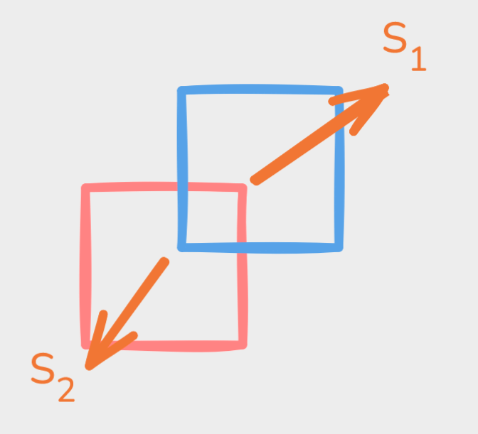
    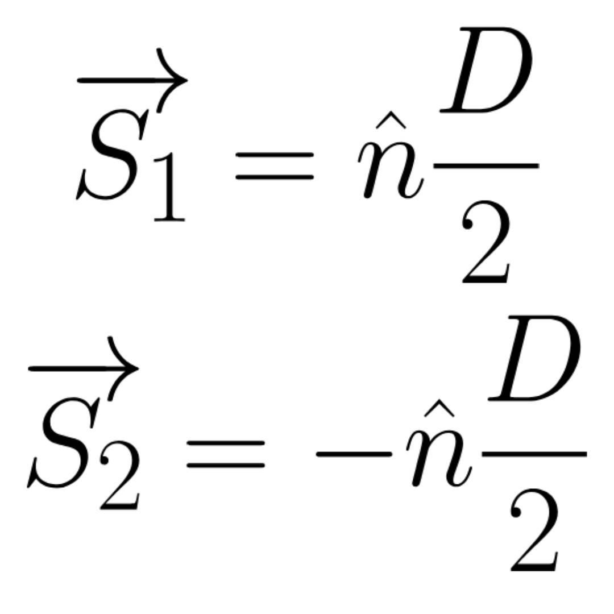
</div>

That is the simplest part, now we have to add some impulses to the bodies to make it slightly more realistic.<br>
Let's start defining a vector <em>V<sub>AB</sub></em> as the relative velocity of the two bodies velocities.

<div align="center">
    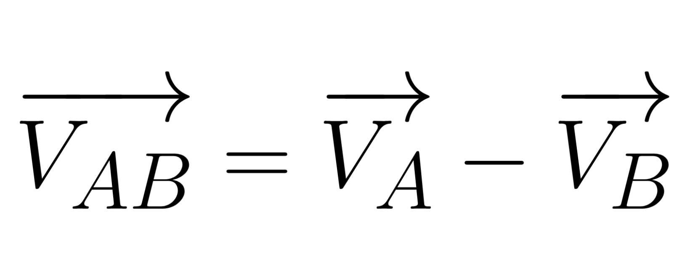
</div>

And with the normal, we could define a <em>"relative normal velocity"</em> using the <em>dot product</em>.

<div align="center">
    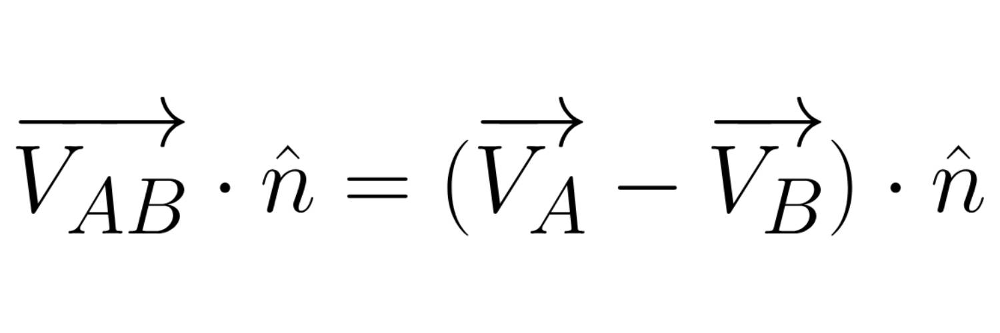
</div>

Here, we are going to use <em>Newton's law of restitution</em> which provides a new parameter of restitution <em>ε</em>. This new parameter can be thought as a parameter of elasticity of a collision between two bodies.<br>
To calculate it, we find several ways according each case. In order to simplify it, we will get only the smallest restitution between the two bodies.

<div align="center">
    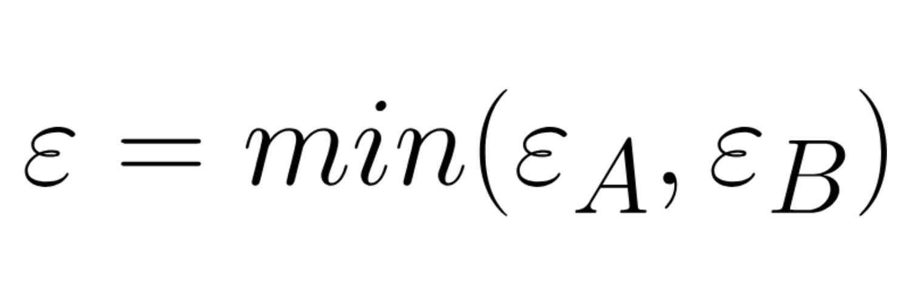
</div>

Next, let's add this restitution to our formula. The new normal relative velocity must be the same but multiplied by this constant restitution.

<div align="center">
    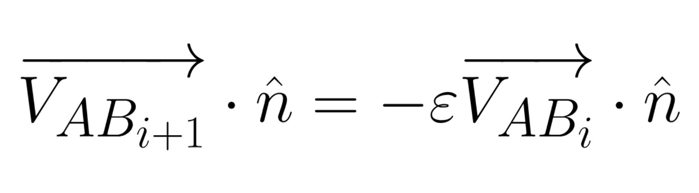
</div>

Let's save this equation here and go to another one. I am going to calculate the new velocity for each body in terms of the last one in the direction of the formula.

<div align="center">
    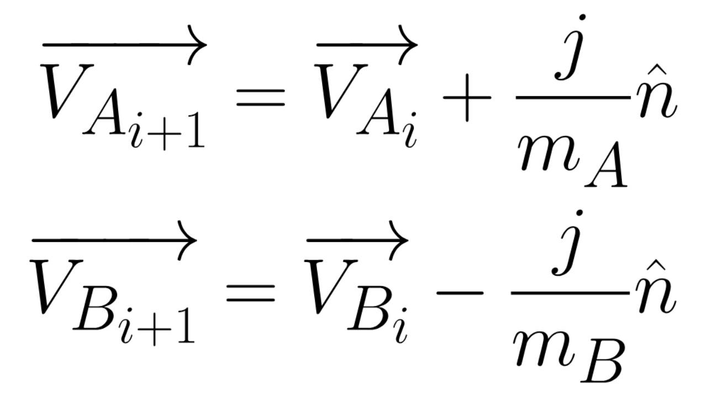
</div>

I multiplied the normal by a constant <em>j</em> that we do not know yet and divided it by the mass of the body because, as we should know, the mass is a parameter of resistance of a body against forces.<br>
Now, let's apply the equation we previously saved to obtain this new equation:

<div align="center">
    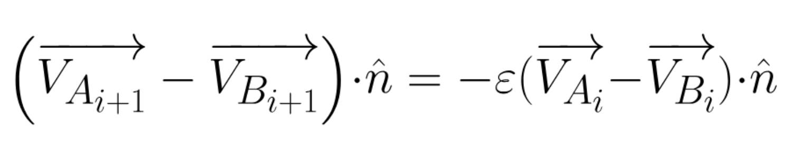
</div>

With that equation, we can expand the expression to obtain this:

<div align="center">
    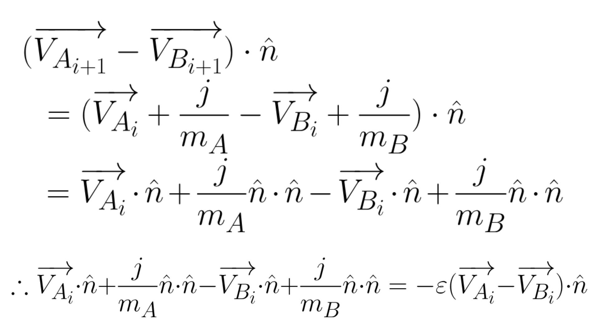
</div>

The equation is getting scary, but stick around, it will be worth it.<br>
The only thing we do not know about this formula is the <em>j</em> constant, so let's write the equation to obtain the value of this number.

<div align="center">
    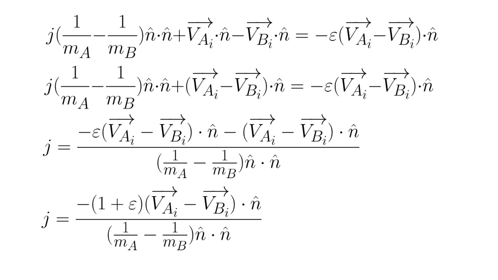
</div>

After all of this, we finally found a formula for everything. Now, it is only matter of programming it on our project and see the math in action.<br>
The result of all of this will be the next formula:

<div align="center">
    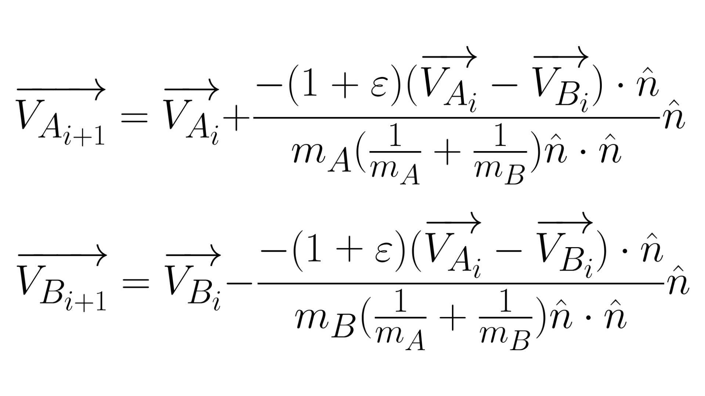
</div>

In our specific case, the vector normal <em>n</em> is normalized, which means its magnitude is 1. Thus, in the denominator where we have the dot product with that vector by itself can be removable because, as we should already know,  the dot product of a vector with itself gives nothing but the magnitude squared and, Since the magnitude is 1 and 1<sup>2</sup> is also 1, we are multiplying all those masses by 1.<br>
In code, this would look like:

```
body1.Position += normal * depth / 2;
body2.Position -= normal * depth / 2;

restitution = Min(restitutionA, restitutionB);

j = -(1 + restitution) * Vector.Dot(linear_velocityA - linear_velocityB, normal);
j /= (1/massA + 1/massB);

body1.linear_velocity += j / massA * normalM
body2.linear_velocity -= j / massB * normal;
```