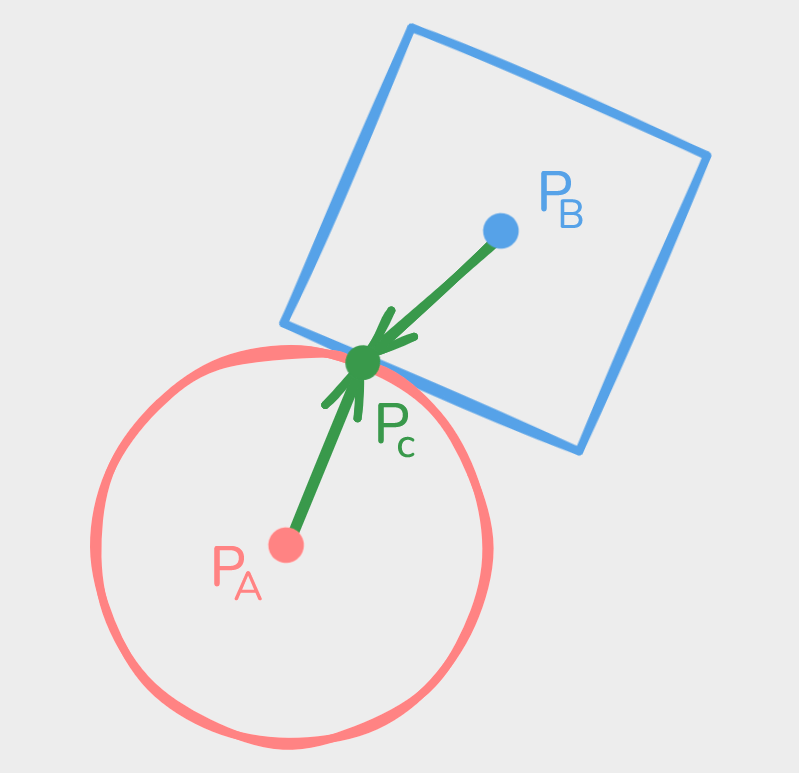
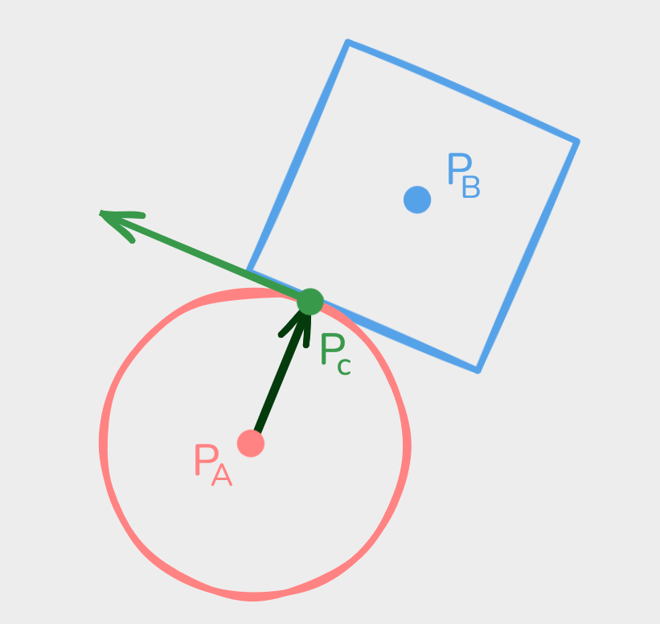
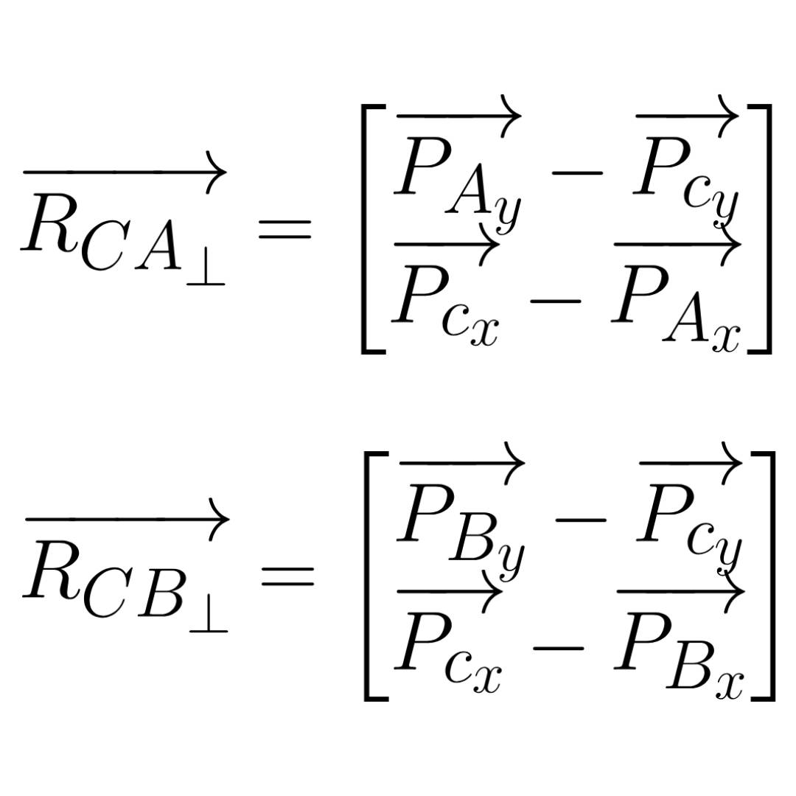
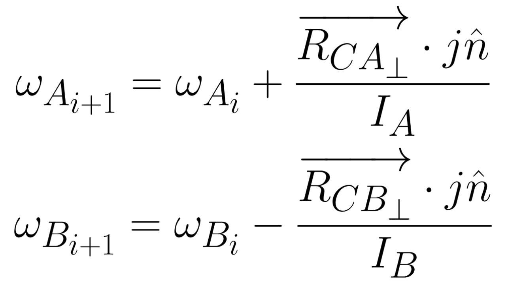
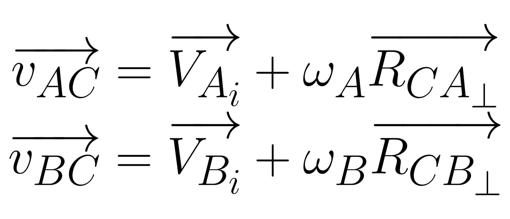
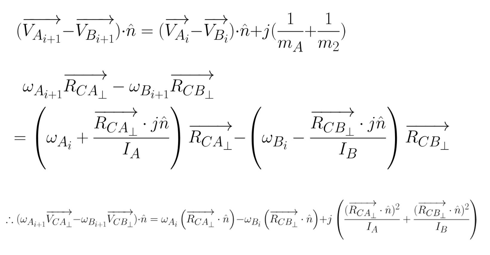
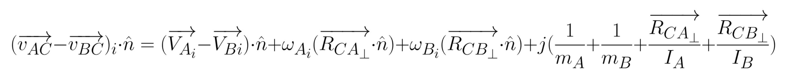
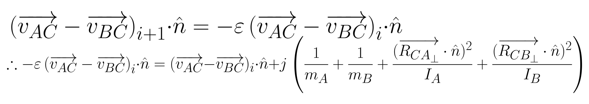
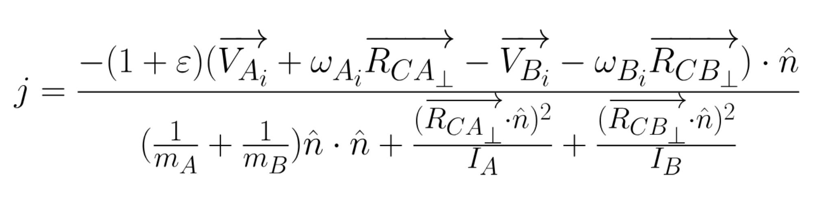

# Angular velocity

Buckle up, this is about to get a little more chic.<br>
Let's add some angular velocity now to make our collisions way more realistic. In the same way as before whatsoever, it does not matter the shape of the bodies, the only thing that actually matters is the information about the bodies such as the position or velocity and the contact points.<br>
For the new formula, we will name the contact point <em>P<sub>c</sub></em> and only have one even though there could be two of them, but since the formula must be replicated for each one without any kind of change, we will only consider one of them and use it for all of them.<br>

<div align="center">
    
</div>

This would be my example case to get all the formulas and logic.<br>
Here, I have got the direction from each body to the contact point, something essential to get the direction of the angular velocity we will next to calculate, because it will be a perpendicular vector to that direction.<br>

<div align="center">
    
    
</div>

Now we have got this perpendicular vector to represent the direction of my angular velocity, in the same way we did for the linear velocity, we can write a formula to calculate the actual angular velocity.<br>
It is important to highlight the fact that, at least in 2 dimensions, angular velocity is a scalar, not a vector, which means that our formula, although it uses vectors, must return a scalar.<br>
<div align="center">
    
</div>

(The <em>I</em> variable is the inertia parameter each body must contain.)<br>
Proving that could be a bit tricky and hard, but the thing we do care is the result and what we are going to write in our codes.<br>
If you check the formula, you will see it needs also the <em>j</em> variable, which means that we need to get its value again to be able to obtain my new angular velocity.<br>
Since this value <em>j</em> is presented in both formulas for linear and angular velocity, we must combine both equations to obtain a real result.<br>
First, since the velocity should be applied at the contact points, let's calculate those velocities.

<div align="center">
    
</div>

Now, we need to obtain the relative velocity just like we have done already when we were trying to get the impulse for linear velocities. We just subtract the velocities of the two bodies and get the dot product of the result with the normal of the collision.<br>

<div align="center">
    
</div>

This is getting intense.<br>
Next, in the same way we calculated the <em>"normal angular velocity"</em> and the <em>"normal linear velocity"</em>, let's do the same for the velocities we have previously calculated at the contact points.

<div align="center">
    
</div>

We cannot forget about the restitution either, so let's use the formula we used in the last lesson.

<div align="center">
    
</div>

We finally have got it, now we just have to solve for <em>j</em>.

<div align="center">
    
</div>

It is too long to place that into the formula, but as you can see, it is almost the same as what we have got for the linear velocity but adding two new factors in the denominator, and we are adding the angular velocity into the relative velocity on the nominator.<br>
Additionally, since this whole formula and forces must be applied once per contact point we found and this would be the total impulse, we need to divide this whole expression by how many contact points we have got.<br>
That was a lot of work, but remember you have to repeat all of that <u>for each found contact point</u>.<br>
We have got another problem: our result is only a vector, but our angular velocity is a scalar. To solve this issue, we need to think that the angular impulse to apply also relies on how parallel is the direction of my angular velocity. Therefore, we can compute the determinant of those vectors to see how much angular  velocity we should apply.

```
determinant(v1, v2)
    return v1.x * v2.y - v2.x * v1.y

for i <- 0 to #contact_points step 1
    contact_point = contact_points[i];
    
    ra = contact_point - body1.position;
    rb = contact_point - body2.position;

    ra_perp = (-ra.y, ra.x);
    rb_perp = (-rb.y, rb.x);

    velocity_a = body1.linear_velocity + ra_perp * body1.angular_velocity;
    velocity_b = body2.linear_velocity + rb_perp * body2.angular_velocity;

    relative_velocity = velocity_a - velocity_b;

    vel_along_normal = Vector.Dot(relative_velocity, normal);
    if vel_along_normal > 0
        continue;

    restitution = min(body1.restitution, body2.restitution);

    ra_perp_dot_n = dot(ra_perp, normal);
    rb_perp_dot_n = dot(rb_perp, normal);

    j = -(1 + restitution) * vel_along_normal;
    j /= (1/body1.mass) + (1/body2.mass)
         + (ra_perp_dot_n^2) / body1.inertia
         + (rb_perp_dot_n^2) / body2.inertia;
    j /= contact_points_amount;

    impulse = j * normal;

    body1.linear_velocity -= impulse / body1.mass;
    body1.angular_velocity -= determinant(ra, impulse) / body1.inertia;

    body2.linear_velocity += impulse / body2.mass;
    body2.angular_velocity += determinant(rb, impulse) / body2.inertia;
```