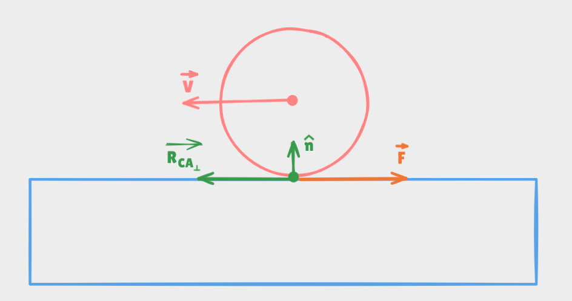
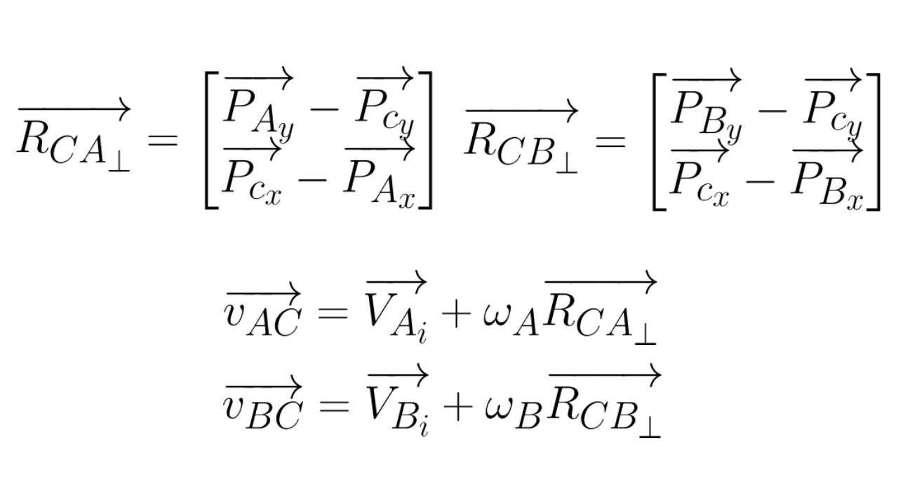
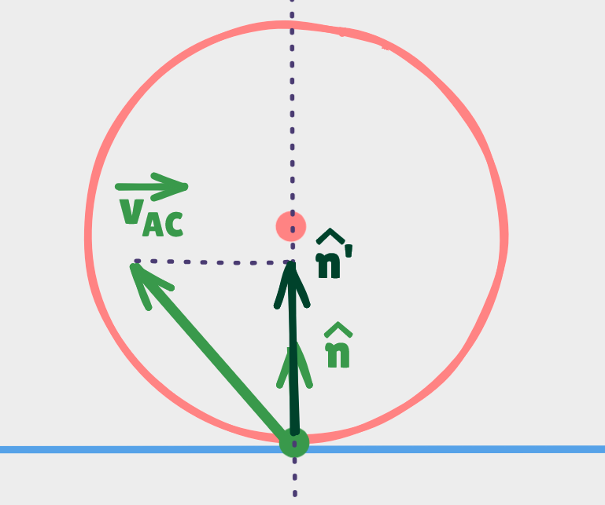
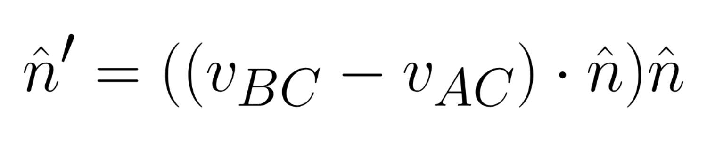
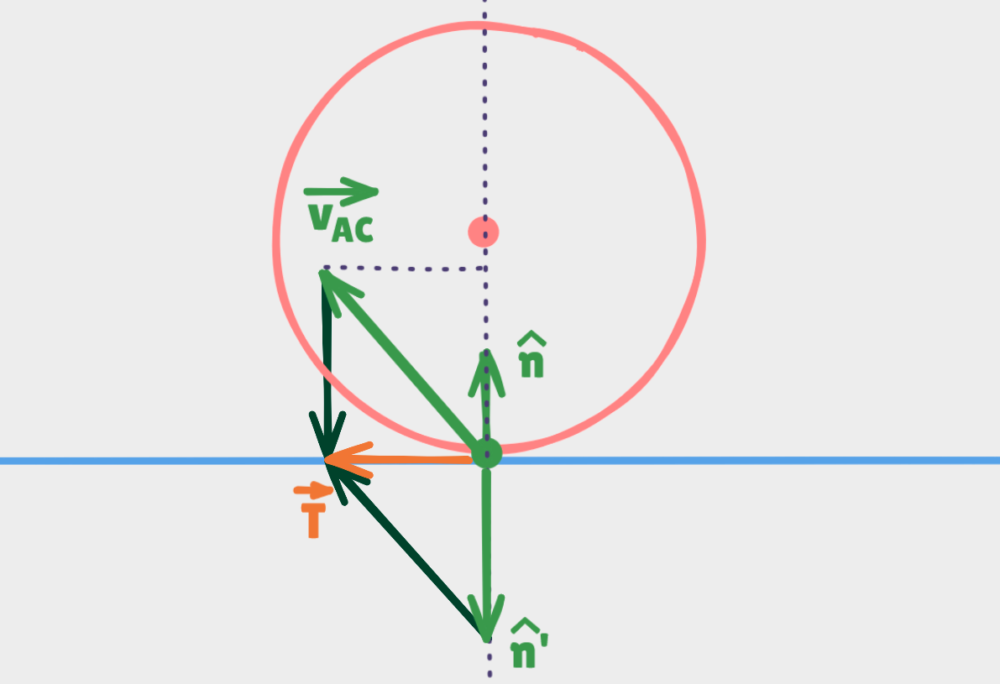
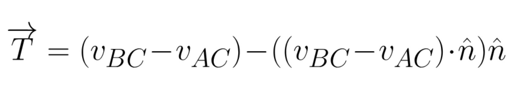
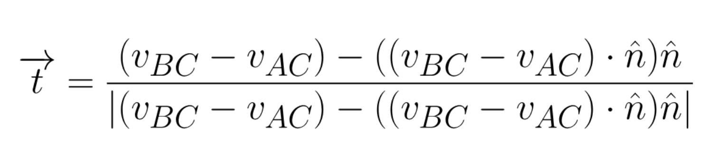
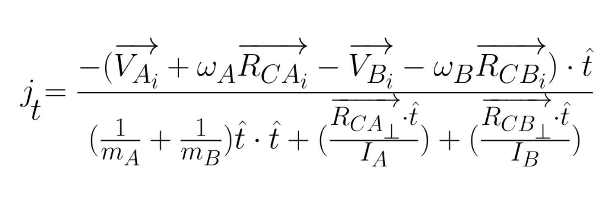
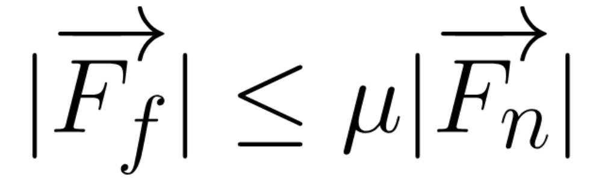
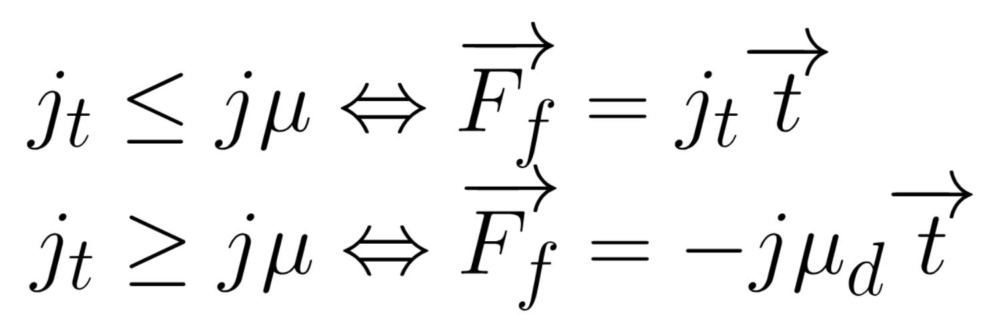

# Friction

After all the work we have made all along, this last lessons will be a piece of cake.<br>
Before starting, we have to bear in mind that there are two types of friction<br>

<ul>
    <li><strong>Static friction</strong> is the friction experiments by </li>
    <li><strong>Dynamic friction</strong>, also called as <em>kinetic friction</em>, is the friction two bodies experiment when at least one of them is moving while is touching the other body.</li>
</ul>

First, let's see a diagram of what we want to make in this lesson.

<div align="center">
    
</div>

As un can see, my vector <em>F</em>, which represents the friction of the body, is like the vector we have calculated in the last perpendicular to the normal <strong><em>(tangent)</em></strong>, but in the opposite way. Thus, we can reuse many of the operations we have made so far.<br>
Let's first catch up on the formulas.

<div align="center">
    
</div>

That is all we need to begin adding friction.<br>
What we need now is try to obtain at least the tangent direction which will be my friction force.<br>
Let's suppose we already got the new velocity and all of that. Now, we must project my new relative velocity onto the normal vector and multiply it by the normal again.

<div align="center">
    
    
</div>

Since we want it to point in the opposite direction, we will multiply by -1 and, additionally, I will add this result to my relative velocity at the contact point. Or what is the same, I subtract the relative velocity at the contact point by mi vector <em>n'</em> we just calculated. This operation will bring us a tangent vector.

<div align="center">
    
    
</div>

Additionally, we also need to normalize this vector in order to be able to set a specific strength to the force later, we are only interest in the direction. 

<div align="center">
    
</div>

Next, once we have got the direction, we need to calculate the strength. We can reuse the previous operations but changing some parameters: we can remove the restitution parameter, we change the normal by the recently calculated <em>t</em> vector

<div align="center">
    
</div>

There is another physics law by <em>Coulomb</em> which brings another perspective for friction forces:

<div align="center">
    
</div>

In our case, |<em>F<sub>t</sub></em>| refers to my last <em>j<sub>t</sub></em> we just have obtained, <em>μ</em> refers to the average of the static friction of the two bodies in the collision and the |<em>F<sub>n</sub></em>| refers to the value <em>j</em> we have calculated in the previous lessons.<br>
If our <em>j<sub>t</sub></em> disobeys this rule, it means that the bodies are not moving, which means we need to change the equation. In lieu of just multiply this <em>j<sub>t</sub></em> times the tangent to obtain the force, we will use the last <em>j</em> inverted <em>(-j)</em> multiplied by the average of the dynamic friction and then the tangent.

<div align="center">
    
</div>

```
determinant(v1, v2)
    return v1.x * v2.y - v2.x * v1.y
    
for i <- 0 to #contact_points step 1
    contact_point = contact_points[i];
    
    static_friction  = (body1.static_friction + body2.static_friction) / 2;
    dynamic_friction = (body1.dynamic_friction + body2.dynamic_friction) / 2;

    ra_perp = (-ra.y, ra.x);
    rb_perp = (-rb.y, rb.x);

    vel_a = body1.linear_velocity + ra_perp * body1.angular_velocity;
    vel_b = body2.linear_velocity + rb_perp * body2.angular_velocity;

    relative_velocity = vel_b - vel_a;

    tangent = Vector.Normalize(relative_velocity - Vector.Dot(relative_velocity, normal) * normal);

    vel_along_tangent = Vector.Dot(relative_velocity, tangent);

    ra_perp_dot_t = Vector.Dot(ra_perp, tangent);
    rb_perp_dot_t = Vector.Dot(rb_perp, tangent);

    denominator = (1 / body1.mass) + (1 / body2.mass) +
                  (ra_perp_dot_t ^ 2) / body1.inertia + (rb_perp_dot_t ^ 2) / body2.inertia;

    jt = -vel_along_tangent / denominator / contact_points_amount;

    friction_impulse;
    if abs(jt) <= j * static_friction
        friction_impulse = jt * tangent;
    else
        friction_impulse = -j * dynamic_friction * tangent;

    body1.linear_velocity -= friction_impulse / body1.mass;
    body1.angular_velocity -= determinant(ra, friction_impulse) / body1.inertia;

    body2.linear_velocity += friction_impulse / body2.mass;
    body2.angular_velocity += determinant(rb, friction_impulse) / body2.inertia;
```